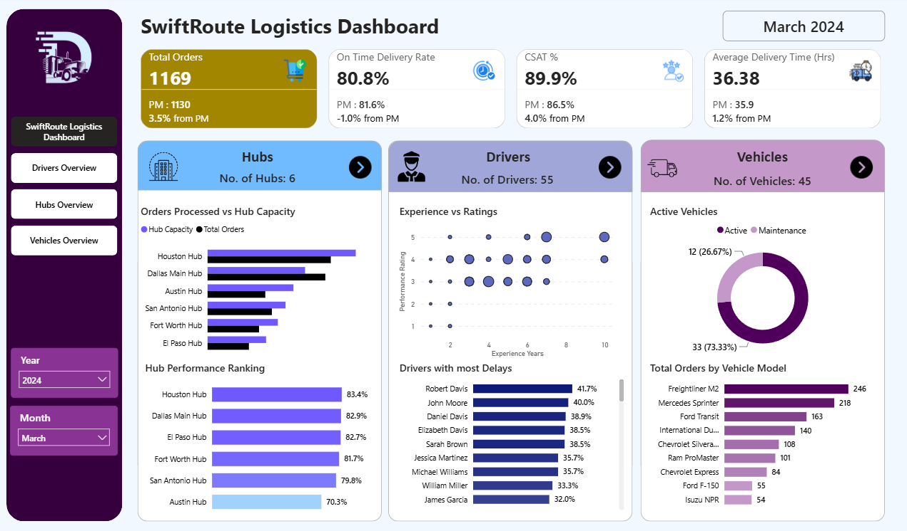
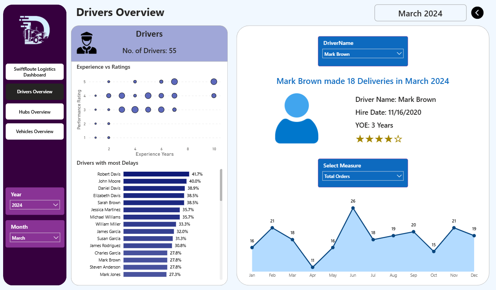
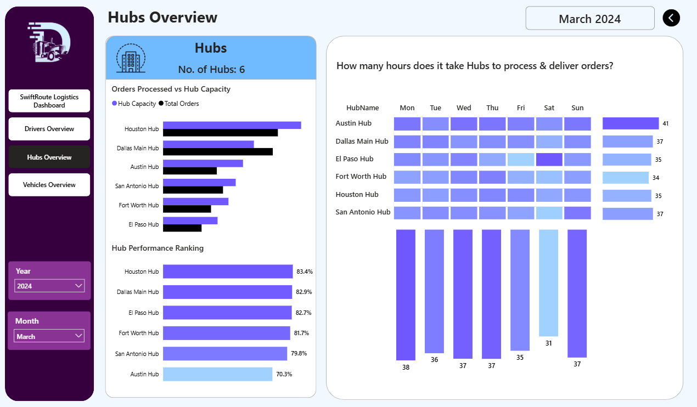
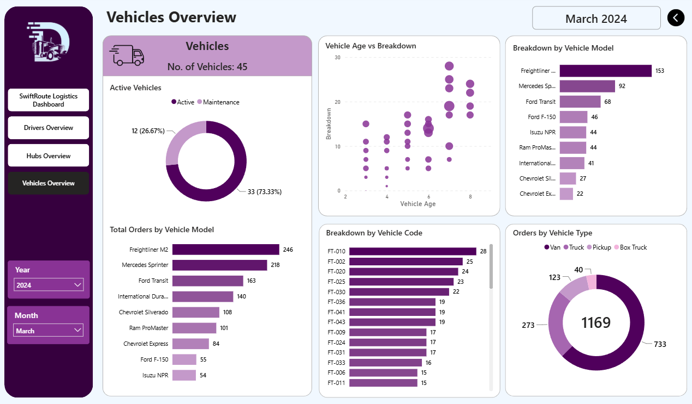
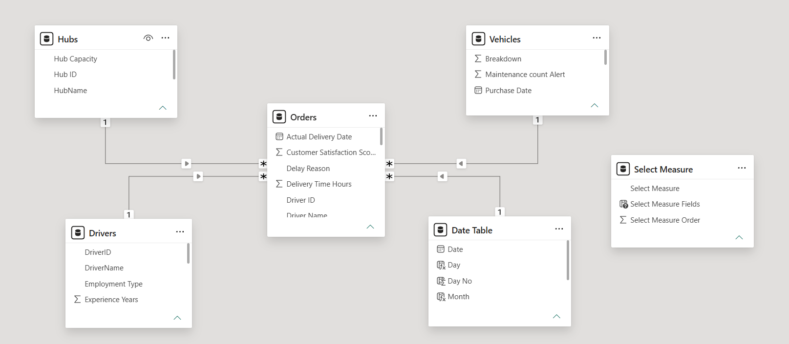

# E-Commerce Logistics & Delivery Analytics 🚚
**A Power BI analytics solution for 'Swift-Route Logistics' - a multi-hub logistics network — tracking delivery performance, driver efficiency, hub throughput, and fleet health across 27K+ orders.**

> 📊 4-page interactive dashboard · 🏢 6 hubs · 🚐 45 vehicles · 🤠 55 drivers · 📦 27,979 orders (2023–2024)

---

## 📸 Preview

| Overview | Drivers |
|---|---|
|  |  |

| Hubs | Vehicles |
|---|---|
|  |  |

---

## 🎯 Business Problem

SwiftRoute operates delivery hubs across Texas and needed a single source of truth to answer:

- Are we hitting on-time delivery targets, and is that trending up or down month over month?
- Which hubs are over/under capacity, and which are slowest to process orders?
- Which drivers are high performers vs. contributing disproportionately to delays?
- Which vehicles/models are breaking down most, and how does age affect reliability?

This dashboard was built to give a month-by-month, drillable view into all four areas from one place instead of manually pulling reports from separate spreadsheets.

---

## 🧱 Data Model

Star Schema with `Orders` as the fact table, joined to 3 dimension tables:
- Drivers
- Hubs 
- Vehicles 



---

## 📄 Dashboard Pages

### 1. Overview
KPI cards for **Total Orders, On-Time Delivery Rate, CSAT %, and Average Delivery Time**, each with month-over-month comparison. Summary visuals for hubs, drivers, and vehicles.

### 2. Drivers Overview
Driver-level slicer with a **Profile Card**, an **Experience-VS-Rating Scatter Plot** to spot skill gaps, a **Most-Delays Bar Chart** for targeted coaching, and a **Monthly Order Trend** area chart.

### 3. Hubs Overview
**Orders-VS-Hub Capacity**, **Hub Performance Ranking** and a **Daily Hub Process & Delivery Time Matrix** to catch slow-turnaround days.

### 4. Vehicles Overview
**Fleet Status Donut Chart**, **Orders by Vehicle Model**, **Vehicle Age VS Breakdown Scatter Plot** (identifies aging high-risk vehicles), **Breakdowns by Vehicle Code/Model**, and **Orders by Vehicle Type**.

---

## 🗂️ Repository Structure

```
swiftroute-logistics-dashboard/

├── data/
│     ├── # Drivers.xlsx, Hubs.xlsx, Orders.xlsx, Vehicles.xlsx
│     └── data_dictionary.md
├── docs/
│     ├──  business_requirements.md
|     └── data_model.png
├── report/
│     ├── PBI Report.pbix
├── assets/
│     └── screenshots/
│        ├── 01_overview.png
│        ├── 02_drivers.png
│        ├── 03_hubs.png
│        └── 04_vehicles.png
├── README.md

```

---

## 🛠️ Tech Stack

- **Power BI Desktop** — Data Modeling, DAX measures, Report Design
- **DAX** — MoM growth calculations, On-time/delay rate measures, Dynamic titles etc
- **Microsoft Excel** — source data (Orders, Drivers, Hubs, Vehicles)
- **Star Schema Modeling** — one fact table, three dimension tables

---

## 📚 Data Dictionary

See [`data/data_dictionary.md`](data/data_dictionary.md) for full field-level definitions across all four tables (Orders, Hubs, Drivers, Vehicles).
